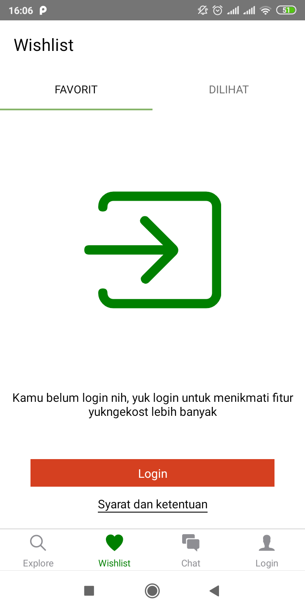
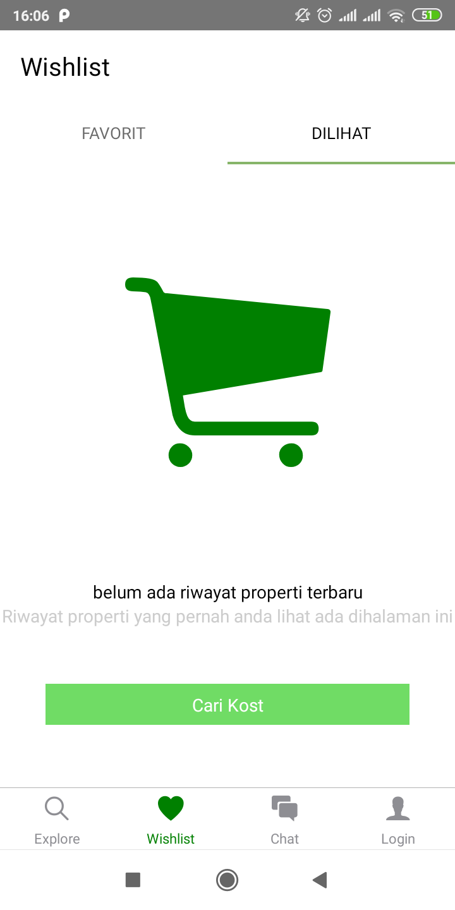
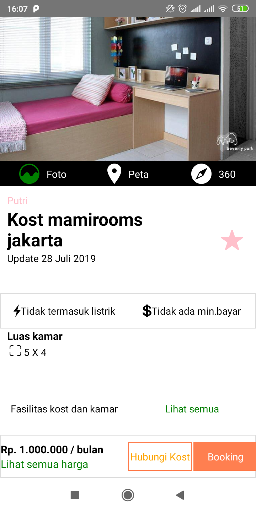

# APLIKASI MAMI KOS
Aplikasi mamikos bertujuan untuk mempermudah pencarian kost di berbagai daerah

## SCREENSHOOTS
     
## STACK YANG DIGUNAKAN
- React Native Sebagai Frontend
- Express.js Sebagai backend

## INSTALLASI DAN KONFIGURASI
Ikuti step dibawah ini

### FRONTEND
```
git clone https://github.com/refanfernandoputra/mamikost-front-end.git
cd mamikost-front-end
npm install
npm start
react-native run-ios #for ios
react-native run-android #for android
```

## CONTACT
- Refan Fernando Putra
  - Wa/Telegram: +62 896 55704793
  - E-Mail: refanfernando@gmail.com
 
